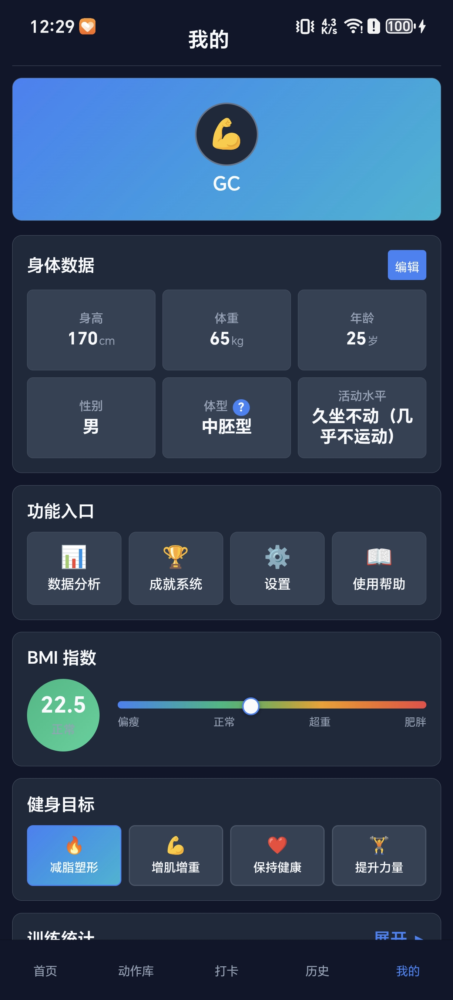
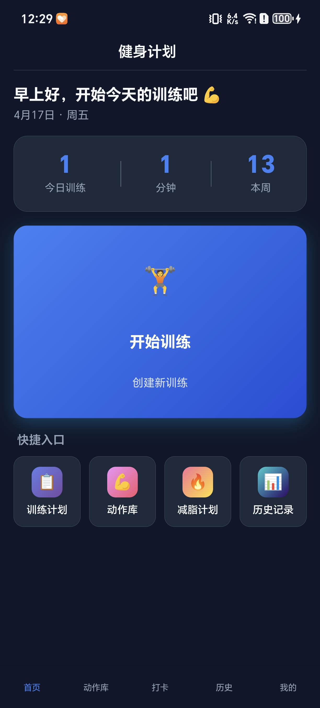
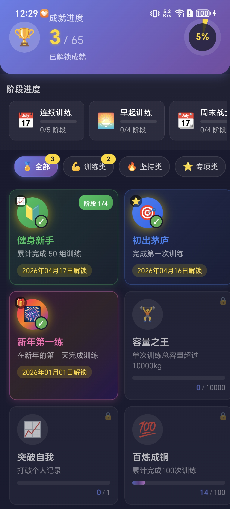

# 🏋️ 健身助手 v2.0

一款完善的健身管理应用，支持Android、微信小程序、H5等多端发布。



---

## ✨ 功能特性

- 📚 **102个动作库** - 覆盖6大肌群，每个动作都有视频教学
- 💡 **智能训练建议** - 基于历史数据推荐训练重量和次数
- 🏆 **成就系统** - 游戏化设计，让健身更有成就感
- 📊 **数据可视化** - 训练容量趋势图、力量进步曲线
- ⏱️ **组间歇计时** - 训练中自动计时
- 📱 **跨平台支持** - 一次开发，多端运行

---

## 📸 案例展示

| 首页 | 数据分析 |
|------|----------|
|  |  |

> 📖 **查看完整案例展示**: [SHOWCASE.md](SHOWCASE.md)

---

## 🛠️ 技术栈

- **前端框架**：uni-app 3.0 + Vue 3.4 + Vite 5.2
- **图表库**：uCharts 2.5
- **开发工具**：Trae SOLO + HBuilderX

---

## 🚀 快速开始

```bash
# 安装依赖
npm install

# H5开发
npm run dev:h5

# 微信小程序开发
npm run dev:mp-weixin

# Android App开发
npm run dev:app
```

---

## 📥 下载

### Android APK
- [健身助手 v2.0.apk](releases/fitness-helper-v2.0.apk) (20.6 MB)

---

## 📱 支持平台

- Android APK（已打包10+版本）
- 微信小程序
- H5网页

---

## 📂 项目结构

```
uni-app-version/
├── components/          # 自定义组件
├── pages/              # 页面文件
├── static/             # 静态资源
│   └── images/
│       └── showcase/   # 案例展示图片
├── store/              # 状态管理
├── utils/              # 工具模块
├── releases/           # 发布文件
│   └── fitness-helper-v2.0.apk
├── App.vue             # 根组件
├── pages.json          # 页面配置
├── manifest.json       # 应用配置
├── SHOWCASE.md         # 案例展示文档
└── vite.config.js      # 构建配置
```

---

## 💡 开发故事

这个项目使用**Trae SOLO从0到完成MVP开发**，零成本、纯本地架构，无需服务器。

---

