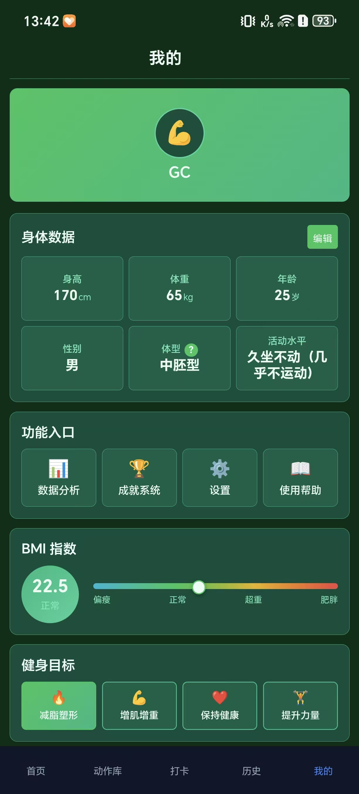
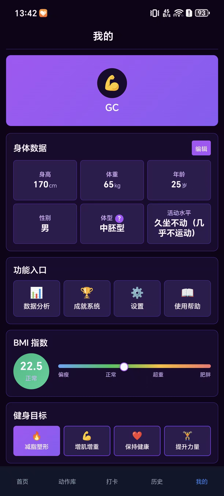
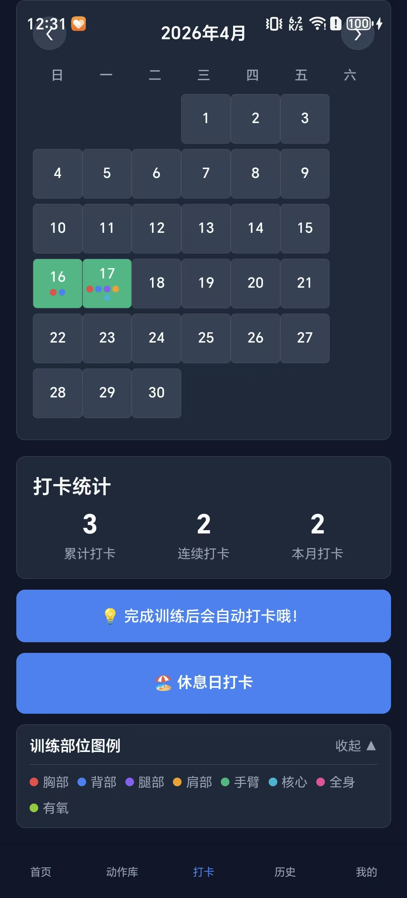
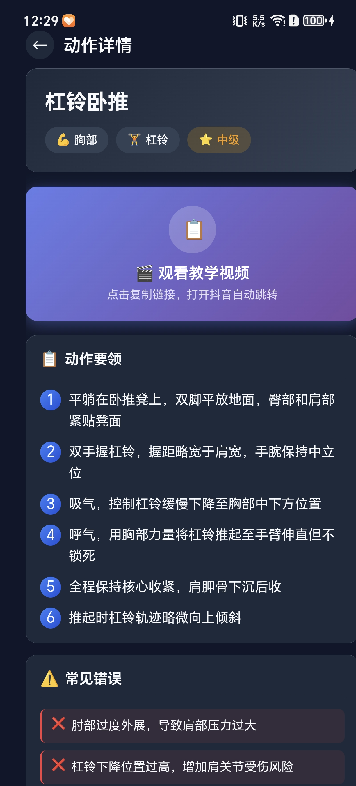
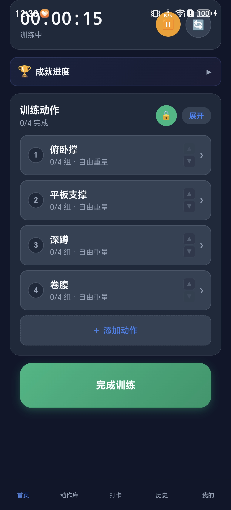
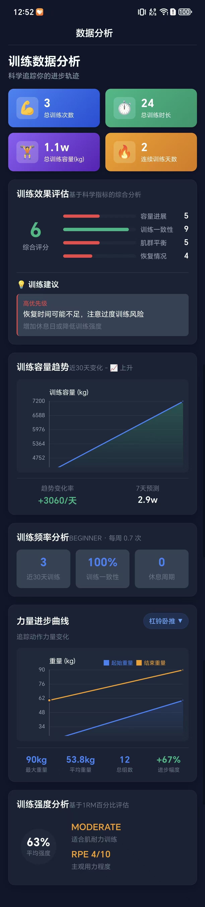
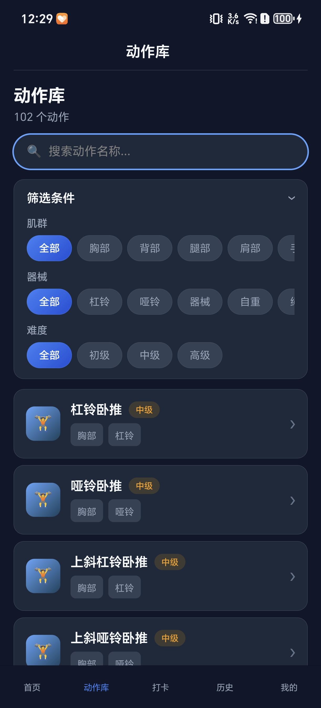
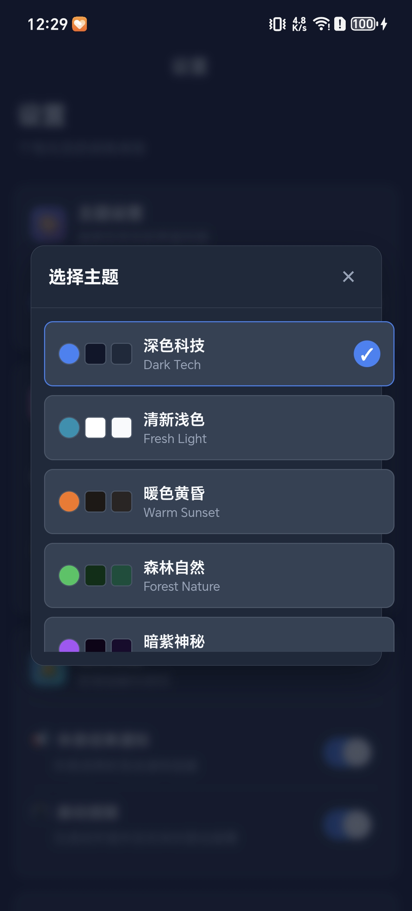

# 🏋️ 健身助手 v2.0

一款跨平台健身管理应用，支持Android、iOS、微信小程序、H5等多端发布。


---

## ✨ 功能特性

- 📚 **102个动作库** - 覆盖6大肌群，每个动作都有视频教学
- 💡 **智能训练建议** - 基于历史数据推荐训练重量和次数
- 🏆 **成就系统** - 游戏化设计，让健身更有成就感
- 📊 **数据可视化** - 训练容量趋势图、力量进步曲线
- ⏱️ **组间歇计时** - 训练中自动计时
- 📱 **跨平台支持** - 一次开发，多端运行

---

## 📸 案例展示

### 首页与训练计划
| 首页 | 训练计划 |
|------|----------|
|  |  |

### 动作库与详情
| 动作库 | 动作详情 |
|--------|----------|
|  |  |

### 数据分析与成就
| 数据分析 | 成就系统 |
|----------|----------|
|  |  |

### 个人中心与历史记录
| 个人中心 | 历史记录 |
|----------|----------|
|  |  |

### 体脂计算器与日历
| 体脂计算 | 训练日历 |
|----------|----------|
|  |  |

---

## 🛠️ 技术栈

- **前端框架**：uni-app 3.0 + Vue 3.4 + Vite 5.2
- **图表库**：uCharts 2.5
- **开发工具**：Trae SOLO + HBuilderX

---

## 🚀 快速开始

```bash
# 安装依赖
npm install

# H5开发
npm run dev:h5

# 微信小程序开发
npm run dev:mp-weixin

# Android App开发
npm run dev:app
```

---

## 📱 支持平台

- Android APK（已打包10+版本）
- 微信小程序
- H5网页
- iOS
- 支付宝/百度/头条/京东/快手/小红书/飞书小程序

---

## 📂 项目结构

```
uni-app-version/
├── components/          # 自定义组件
├── pages/              # 页面文件
├── static/             # 静态资源
│   └── images/
│       └── showcase/   # 案例展示图片
├── store/              # 状态管理
├── utils/              # 工具模块
├── App.vue             # 根组件
├── pages.json          # 页面配置
├── manifest.json       # 应用配置
└── vite.config.js      # 构建配置
```

---

## 💡 开发故事

这个项目使用**Trae SOLO在1天内完成MVP开发**，零成本、纯本地架构，无需服务器。

---

## 📄 License

MIT
